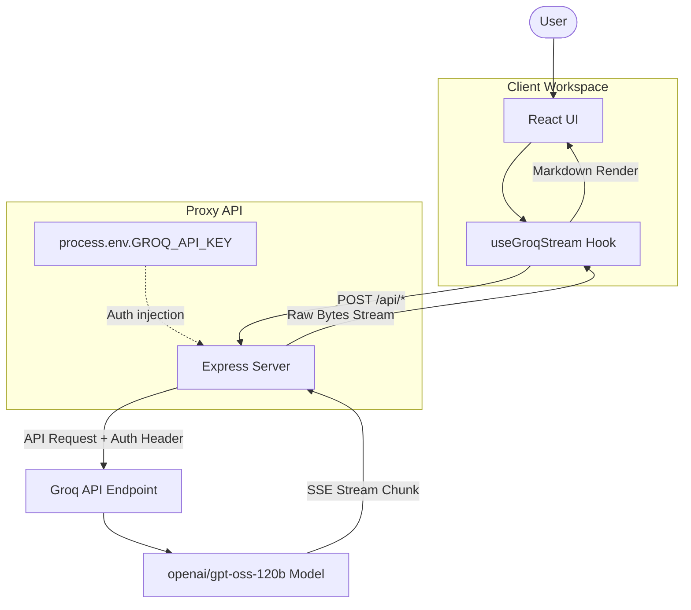

# 🌐 TRiO AI — Think. Build. Create.

TRiO AI is a premium, modern AI productivity suite built using React 19, Vite, and Node.js. It features a high-end, Notion-inspired Light Mode glass workspace, offering three distinct AI assistants powered by **Groq** via a centralized backend proxy.

---

## 📐 Architecture & Flow

To guarantee safety and prevent API key leaks on the client side, TRiO AI separates the frontend interface from direct AI communication using a secure backend proxy.



---

## 🛠️ Functional Modules & Tasks

TRiO AI combines three specialized modules to cover engineering, brainstorming, and writing:

### 1. 🚀 MyStriver (AI Software Engineering Assistant)
A full-featured developer panel for optimizing, explaining, and drafting source code:
*   **Generate Code**: Code drafting based on natural language descriptions.
*   **Review Code**: Rigorous code reviews focusing on edge cases, security, and performance.
*   **Detect Bugs**: Identifies syntax/logical errors and offers fixed code.
*   **Complexity (Big O)**: Analyzes time/space complexity with optimization tips.
*   **Refactor**: Rewrites code using modern language standards.
*   **Explain**: Explains code logic step-by-step in plain language.
*   **Doc Gen**: Generates JSDoc comments, docstrings, and comprehensive comments.
*   **Unit Tests**: Generates unit tests using standard frameworks (Jest, PyTest, etc.).
*   **API Design**: Provides REST/GraphQL schema, validation, and endpoint guides.
*   **System Design**: Outlines database schemas, microservice maps, and scaling strategies.

### 2. 💬 ChatMini (General Conversational AI Assistant)
A Notion-style conversational interface for general reasoning, productivity, and Q&A:
*   **Multi-Turn Chats**: Retains conversation history for continuous contexts.
*   **Persistent Sessions**: Chat sessions are persisted in `localStorage`.
*   **Manage History**: Options to create, rename, and delete conversation threads.
*   **Suggestions**: Quick-start templates for Summarization, Learning, Reasoning, and Brainstorming.

### 3. ✍️ Writer (Creative Writing Studio)
An off-white, warm writing workspace designed for authors, screenwriters, and creative designers:
*   **Character Gen**: Outlines detailed profiles including motivations and backstory.
*   **Story Gen**: Generates stories with narrative pacing and hooks.
*   **World Builder**: Outlines geography, societies, history, and magic systems.
*   **Dialogue Gen**: Creates realistic conversations between characters.
*   **Chapter Gen**: Drafts a full narrative chapter.
*   **Fantasy & Sci-Fi Writing**: Genre-specific writing engines.
*   **Plot Generator**: Outputs exposition, climax, and card plot beats.
*   **Creative Assistant**: Expands, refines, and polishes draft revisions.

---

## 🔌 Backend APIs

The backend Express application listens on port `5000` and serves three SSE (Server-Sent Events) streaming endpoints. All endpoints run using the centralized `openai/gpt-oss-120b` model.

| Endpoint | Method | Payload Format | Description |
| :--- | :--- | :--- | :--- |
| `/api/mystriver` | `POST` | `{ messages: Array, temperature: 0.3 }` | Returns streamed code completions. |
| `/api/chatmini` | `POST` | `{ messages: Array, temperature: 0.7 }` | Returns streamed general conversation chunks. |
| `/api/writer` | `POST` | `{ messages: Array, temperature: 0.8 }` | Returns streamed creative writing chunks. |

---

## 📁 Directory Structure

*   **`backend/`**: Secure Express proxy server using Node.js to communicate with Groq APIs.
*   **`frontend/`**: Single Page React application built with Vite and TailwindCSS, including a custom production static file server (`prod-server.js`).

---

## 🚀 Getting Started

### 1. Backend Setup & Run
Open a terminal and navigate to the `backend/` directory:
```bash
cd backend
```
Create a `.env` file containing:
```env
PORT=5000
GROQ_API_KEY=your_groq_api_key
```
Install dependencies and start the proxy server:
```bash
npm install
npm start
```
The backend server will run at `http://localhost:5000`.

### 2. Frontend Setup & Run
Open a separate terminal and navigate to the `frontend/` directory:
```bash
cd frontend
```
Install dependencies and start the local development client:
```bash
npm install
npm run dev
```
Open `http://localhost:5173` in your browser. (The local client will proxy API requests to `http://localhost:5000` automatically).

---

## ☁️ Production Deployment (e.g., Render)

### Backend Deployment (Web Service)
*   **Root Directory**: `backend`
*   **Build Command**: `npm install`
*   **Start Command**: `npm start`
*   **Environment Variables**:
    *   `GROQ_API_KEY`: Your actual Groq API key (kept secure on backend).

### Frontend Deployment (Static Site or Web Service)
*   **Root Directory**: `frontend`
*   **Build Command**: `npm run build`
*   **Publish Directory**: `dist`
*   **Start Command** (if Web Service): `npm start`
*   **Environment Variables**:
    *   `VITE_API_URL`: Set this to your backend service's URL (e.g., `https://trioai.onrender.com` or `https://trioai.up.railway.app`). Do not append a trailing slash.

